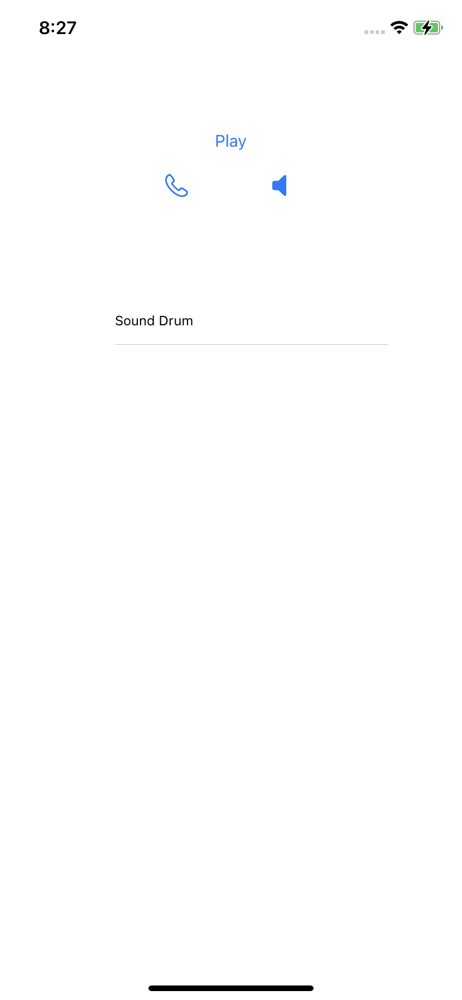

# audioUIKit

  
  &nbsp;
  

A UIKit based app that uses **AVFoundation** to manipulate audio sources.
The app plays a sample audio through the earpiece by default, achieved by using the **AVAudioSession** Class.
The app further has the capability to look for available bluetooth devices connected for audio playback and lets the user switch between **Earpiece**, **Speaker** and the **bluetooth device**.

